

  <h1 align="center">Migração de Webserver Nginx para Docker Containers em Alta Disponibilidade na AWS usando o Docker Swarm</h1>

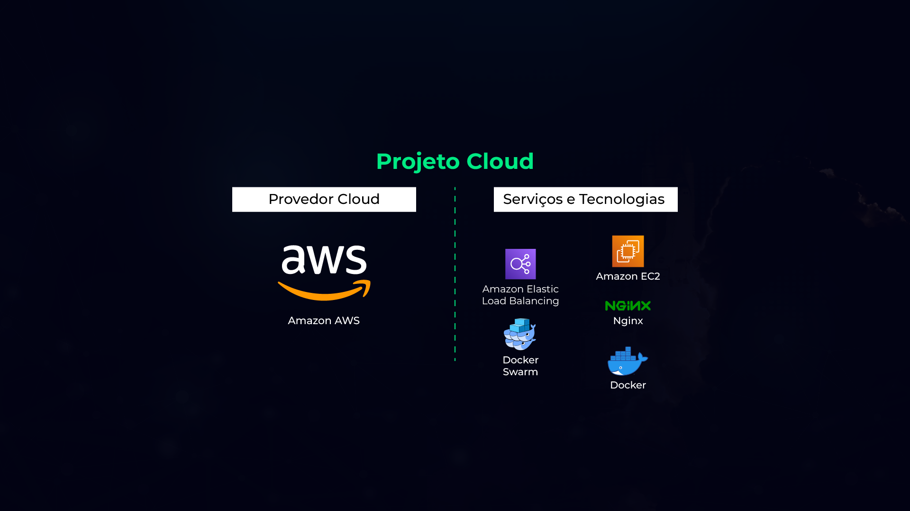

## Descrição do projeto:
Neste projeto de migração para nuvem, baseado em um cenário real, atuei como Engenheiro DevOps migrando a aplicação de um restaurante que rodava usando Nginx em servidores on-premises para AWS.

No entanto, precisei manter a solução Nginx e implementá-la através de containers, com alta disponibilidade e como solução para orquestração, utilizei o Docker Swarm. Além disso, usei o Elastic Load Balancer (ELB) para garantir alta disponibilidade nas 3 instâncias EC2, localizadas em diferentes zonas de disponibilidade.

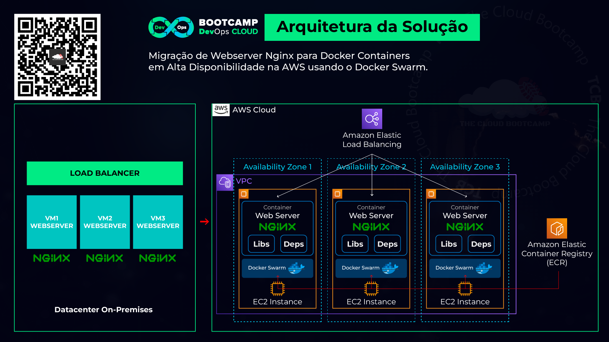

► Passo 01: Criando um repositório na Amazon ECR (Elastic Container Registry)
[ Region: N. Virginia — us-east-1 ]

    Repositório: grandrestaraunt_nginx

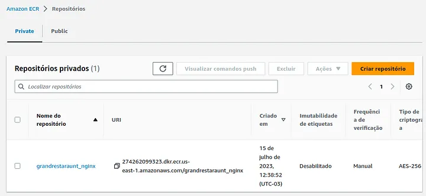

• docker-01 (us-east-1a)

Ubuntu 22.04
t2.micro
Key: swarm-ssh
VPC: Default
Subnet: us-east-1a, us-east-1b and us-east-1c (each VM in different AZ)
Security Group (SG): default

Advanced details | User data: [ script to install Docker ]

#!/bin/bash
hostname -b node-01
curl -fsSL https://get.docker.com -o get-docker.sh
sh get-docker.sh
chmod 666 /var/run/docker.sock
echo ‘ClientAliveInterval 60’ | sudo tee — append /etc/ssh/sshd_config
sudo service ssh restart

Repita os mesmos passos para criar:
• docker-02 (us-east-1b)
• docker-03 (us-east-1c)

Configure a porta 22, 80 na SG ‘default’

► Passo 03: Criando ‘Target Group’ e ‘ELB’

• Target Group: swarm-tg

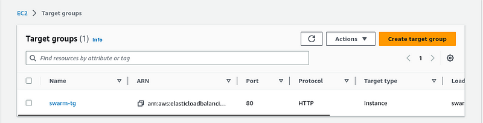

• Elastic LB: swarm-elb

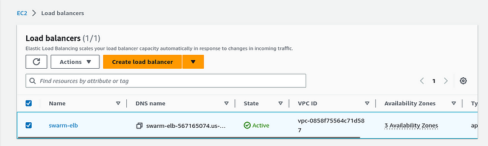

► Passo 04: Creating a Dockerfile, Bulding and Pushing the Image to ECR

• Downloading website files:

curl -O https://tcb-bootcamps.s3.amazonaws.com/bootcamp-devops-cloud/pt/tcb-bdc-module3-hop.zip
unzip tcb-bdc-module3-hop.zip
cd bdc-module3-project/

• Creating a Dockerfile:

touch Dockerfile
vi Dockerfile

FROM nginx:1.22.0
COPY website /usr/share/nginx/html

• Building a Docker Image

docker build -t grandrestaraunt_nginx .
docker images

• Pushing the image created to your AWS ECR repository

docker push [ Your Repository URI ]

docker push 937193033886.dkr.ecr.us-east-1.amazonaws.com/grandrestaraunt_nginx

• Install AWS CLI:
sudo apt install awscli

• Creating a programatic user:
Name: swarm-cli
Police: EC2InstanceProfileForImageBuilderECRContainerBuilds
► Passo 05: Configurando VM ‘docker-01’ como ‘Manager’

docker swarm init — advertise-addr <manager_ip> [ IP Privado da EC2 ‘docker-01’ ]

docker swarm init — advertise-addr 172.31.14.67

~~~~~~~~~~~~~~~~~~~~~~~~~~~~~~~~~~~~~~~~~~~~~~~~~~~~~~~~~~~~~~~~~~~~~~~~~~~~~~~~~~
Você pode usar estes comandos abaixo para pegar os tokens do ‘Managers’ e ‘Workers’:
• To get ‘Manager’ token: docker swarm join-token manager
• To get ‘Worker’ token: docker swarm join-token worker
~~~~~~~~~~~~~~~~~~~~~~~~~~~~~~~~~~~~~~~~~~~~~~~~~~~~~~~~~~~~~~~~~~~~~~~~~~~~~~~~~~~

► Passo 06: Adicionando Worker Nodes no Swarm

Copie o token fornceido pelo ‘Manager’ e execute na VM ‘docker-02’ e ‘docker-03’

► Passo 07: Visualizando Status do Swarm

docker node ls
docker network ls

► Passo 08: Criando um Serviço Swarm

Antes, vamos checar os ‘nodes’:

‘docker ps’ ‘docker images’ ‘docker network ls’

docker service create -p 80:80 — name swarm-web — with-registry-auth [ Your Repo URI ]

docker service ls
docker service ps <service-name or service-id>

‘docker ps’ ‘docker images’

► Testando IP Público da VM docker-01

► Passo 09: Escalando o serviço do Swarm
docker service ls
docker service ps <service-name or service-id>
docker service scale swarm-web=3
docker service ls
docker service ps <service-name or service-id>
'docker ps' 'docker images'

► Passo 10: Testando IP Público do 'docker-02' e 'docker-03'

► Passo 11: Testando ELB

► Passo 12: Checando as informações do Swarm
docker info
Quantos nós?
Quantos Manger/Nodes?
Qual Nó é Managar?
Qual IP do Manager?
Qual a versão do SO?
► Passo 13: Testando 'HA' no nível do Container
Escolha um 'worker node' e execute 'docker rm' (remove container)
docker ps
docker rm id -f [ necessário usar a flag - force ]
docker ps
docker ps
docker ps [ novo container criado automaticamente! ]
docker service ls
docker service ps <service-name or service-id>
► Passo 14: Atualizando o 'Manager' para não receber tarefas!
docker ps
docker node ls
docker node update - availability drain <node-id>
docker node ls [ status 'drain' ]

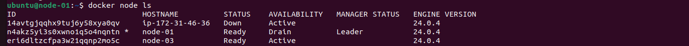

docker ps [ nada ]!

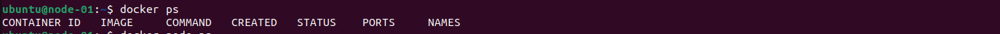

► docker node ps [ shutdown status]

[Alt text](image-7.png)

docker service ls

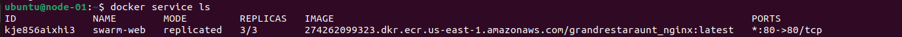

docker service ps <service-name or service-id>

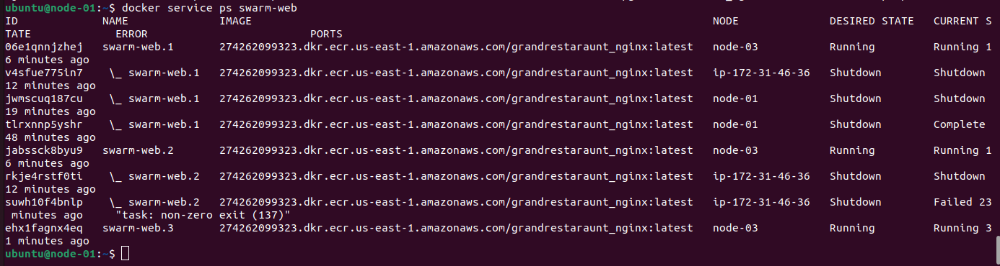

► Passo 15: Testando 'HA' no nível do EC2/VM
Parando uma EC2 para testar a 'HA' do ELB

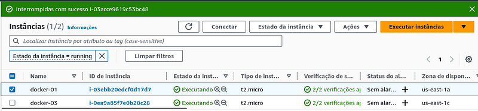

Aplicação rodando:

Containers realocados ao Node-03:

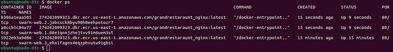